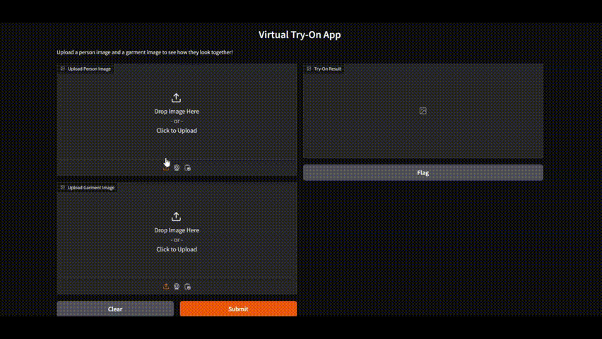

# Virtual Try-On using Gradio Client

This repository contains the code for a virtual try-on application built using Gradio Client.



## Technologies Used
- **Gradio API**: For interacting with the virtual try-on Gradio app, which uses IDM-VTON ([Improving Diffusion Models for Authentic Virtual Try-on](https://huggingface.co/yisol/IDM-VTON)) model under the hood to generate accurate garment try-on results.

## Prerequisites
Before running this project, ensure you have the following:
- Python 3.8+ installed on your machine.
- Use the **Nymbo Virtual Try-On** model as API available on Hugging Face Spaces: [Nymbo Virtual Try-On](https://huggingface.co/spaces/Nymbo/Virtual-Try-On).The API is built using the IDM-VTON (Image-based Virtual Try-On Network) model, which takes images of both a person and a garment to generate realistic try-on results.

## Installation
Clone the repository:
```bash
git clone https://github.com/codemaker2015/virtual-try-on-gradio-client.git
cd virtual-try-on-gradio-client
```
Install the required Python packages:
```
pip install -r requirements.txt
```

## Running the Application
Start the gradio app:
```
python app.py
```
   


